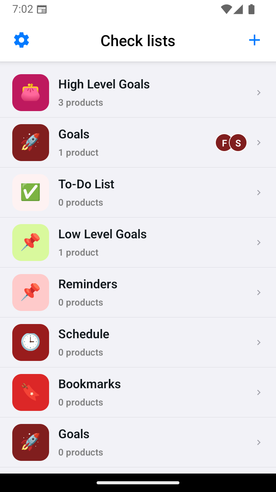
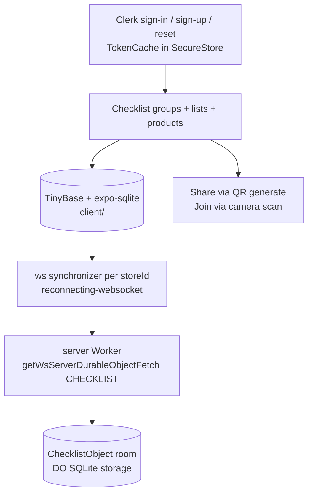
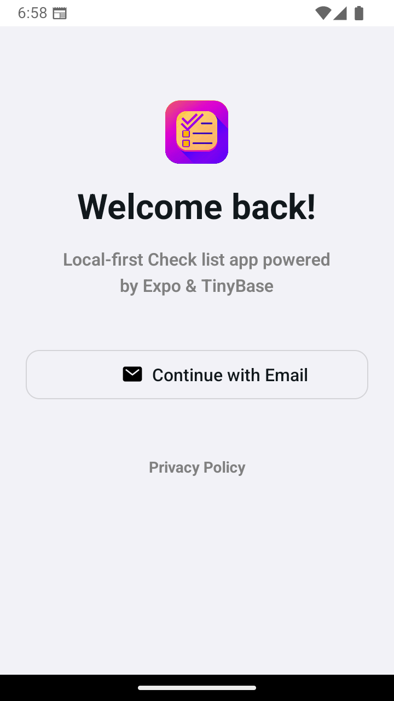
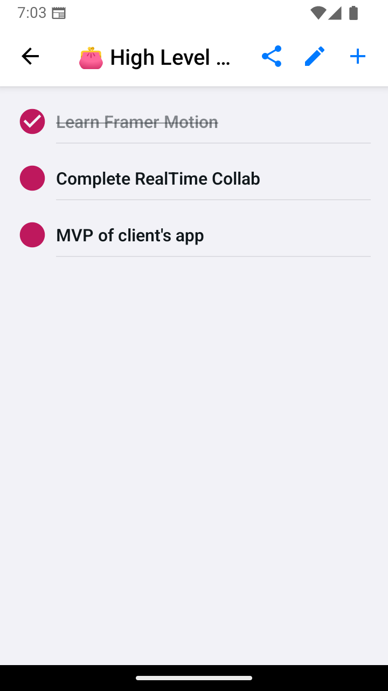

# Checklist

> Shared checklist groups with QR-code joining and offline-first realtime sync — Web, Android, and iOS from one Expo codebase, converging through a self-hosted Cloudflare sync server.

**Stack:** Expo SDK ~52 (`client/`) · React Native 0.76.9 · Expo Router ~4 · TinyBase + `expo-sqlite` · Cloudflare Workers + Durable Objects SQLite (`server/`) · Clerk



| Fact | Evidence |
| --- | --- |
| Monorepo: app + its own sync server | `client/` (Expo app) + `server/` (Worker) at repo root |
| Sync server is 13 lines | `server/src/index.ts` — `ChecklistObject extends WsServerDurableObject`, DO-storage persister, `CHECKLIST` binding |
| One durable room per list | Client opens `SYNC_SERVER_URL + storeId`; server binds `CHECKLIST` with a `v1` SQLite migration |
| QR as the share affordance | `client/` `ScanQRCodeScreen` + `ShareListScreen` QR generation |
| Sessions survive restarts securely | `client/cache.ts` TokenCache on `expo-secure-store` |

## The Problem

Single-device todo apps can't share. Coordinating a grocery run or packing list across friends means retyping items into chat threads that immediately go stale — no shared state, no convergence, no offline tolerance.

## The Solution

A local-first monorepo. The Expo client writes to TinyBase/SQLite on device, then a websocket synchronizer pushes/pulls against the repo's own Cloudflare Worker — one Durable Object room per list (`storeId`), persisted in DO SQLite storage. Clerk owns per-user identity; a QR code owns group membership — scan to join, no invite plumbing.



## Key Features

**Shared groups and lists.** Group-centric model with product lists, quantity adjustment, notes, and emoji/color identity. Why it matters: shared state is the product — everything else is access to it.

**QR join.** Generate a code on the share screen, scan it on another device to join. Why it matters: group membership in one camera gesture beats any invite flow.

**Offline-first sync.** Local writes apply instantly; the synchronizer converges when connectivity returns, with explicit load-then-save on every reconnect. Why it matters: grocery stores have bad signal — the list must work there.

**Self-hosted sync server.** `server/` is a Cloudflare Worker, not a third-party service: one `WsServerDurableObject` subclass, a mergeable store per room, DO SQLite persistence, observability on. Why it matters: the sync backend is versioned, deployable, and reviewable in the same repo as the app.

**Per-user auth.** Clerk email flow with OS-secured token caching. Why it matters: shared lists still need to know *who* added the item.

**Cross-platform.** Web, Android, iOS from one router. Why it matters: groups are device-heterogeneous by definition.

## Key Engineering Decisions

**Problem → Constraint → Decision → Tradeoff → Result**

1. **Lists must work offline and still converge.** Constraint: a server-round-trip-per-keystroke model dies without signal. Decision: TinyBase over `expo-sqlite` as the local source of truth, `reconnecting-websocket` synchronizer (1s max redelay/timeout, explicit load/save on reconnect) to the repo's own Worker. Tradeoff: two consistency models to reason about (local vs. converged). Result: instant local writes with peer convergence — and the server half is 13 lines, not a platform.

2. **One room per list, durable by default.** Constraint: a single shared backend table would mix unrelated groups' data and lose it on restart. Decision: Durable Object per `storeId` (`SYNC_SERVER_URL + storeId` on the client, `CHECKLIST` binding + `v1` SQLite migration on the server) with `createDurableObjectStoragePersister` over a mergeable store. Tradeoff: Cloudflare-coupled sync (Wrangler deploys, `compatibility_date` pinning). Result: per-list isolation with crash-safe persistence and observability enabled.

3. **Sessions must survive cold starts without leaking.** Constraint: in-memory sessions force re-login; plaintext caching leaks tokens. Decision: `client/cache.ts` TokenCache on `expo-secure-store` (with corrupt-key deletion and web-safe `undefined`). Tradeoff: platform-specific auth code in a cross-platform app. Result: persistent, OS-secured sessions.

4. **Invites must be near-zero friction.** Constraint: account-based invites exclude whoever isn't set up yet. Decision: QR generate + camera scan as the join path (`expo-camera`, `react-native-qrcode-svg`). Tradeoff: physical proximity (or a screenshot) instead of remote invites. Result: the fastest possible group-join for co-located users.

## Iteration Story

The working copy carries no git history (no `.git` at root), so no commit arc can be evidenced — everything below is read from the current tree. What the tree shows is a deliberate second phase: the Expo client (TinyBase + SQLite + websocket sync, Clerk auth, QR screens, list/product depth) now sits beside its own sync backend. Previously the sync endpoint was an external deployment the client merely pointed at; now `server/` brings it in-repo as a versioned Worker with a SQLite-backed Durable Object, local dev state (gitignored `.wrangler/`), and typed bindings (`worker-configuration.d.ts` via `cf-typegen`). Sync and identity still came before screens architecturally — the right order for a collaboration app — but reviewers should read the structure, not a log.

## User Experience

Sign in, open a group, and build lists of products with quantities, notes, and colors. Share via QR; join by scanning. Lists render from the local store instantly, converge over the socket when online, and follow light/dark theming. Empty states guide first-run; haptics keep interactions tactile.

## Results & Evidence

**Verifiable:** client sync path (per-`storeId` rooms, reconnect load/save), QR screens, token cache, and the 13-line Worker with its `CHECKLIST` binding and `v1` migration are all present and reviewable.

**Honest limits:** Jest (`jest-expo`) is configured but only one component test exists (`ThemedText` + snapshot); the server's `test/index.spec.ts` is still the default Cloudflare "Hello World" scaffold and does not exercise the Durable Object or websocket path. No coverage figures or usage metrics are recorded. Point `EXPO_PUBLIC_SYNC_SERVER_URL` at the Worker's dev or production URL before release — and note there is currently no `.git` history in the working copy to review.

## Technical Details

| Area | Detail |
| --- | --- |
| Client | Expo ~52.0.46, React 18.3.1, RN 0.76.9, Expo Router ~4.0.20 (`client/`) |
| Client data | `tinybase` + `expo-sqlite`; sync via `reconnecting-websocket` (`SYNC_SERVER_URL + storeId`, 1s redelay/timeout, load/save on reconnect) |
| Server | Cloudflare Worker (`server/`, `wrangler.jsonc`): `ChecklistObject extends WsServerDurableObject`, DO SQLite persister, `CHECKLIST` binding, `v1` migration, observability on, `compatibility_date 2025-04-17` |
| Server scripts | `npm run dev` / `start` (`wrangler dev`), `npm run deploy`, `npm test` (vitest workers pool), `cf-typegen` |
| Auth | `@clerk/clerk-expo`, `expo-auth-session`, `expo-secure-store` TokenCache |
| Routes | `client/app/(auth)/` (index, sign-in, sign-up, reset-password, privacy-policy); `client/app/(checklist)/` (index, profile, color/emoji pickers, `list/new`, `list/[listId]`, `product/new|[productId]`) |
| Key files | `client/cache.ts`, `client/context/ListCreationContext.tsx`, `client/stores/CheckListStore(s).tsx`, `client/stores/synchronization/`, `server/src/index.ts` |
| Secrets | `EXPO_PUBLIC_CLERK_PUBLISHABLE_KEY`, `EXPO_PUBLIC_SYNC_SERVER_URL` (now the Worker URL) — never committed; `.wrangler/` local state is gitignored |
| Tests | Client: `jest-expo` preset, single `ThemedText` test. Server: vitest scaffold asserting "Hello World" — does not cover the sync path |

## Setup

1. **Prerequisites:** Node 18+, npm or yarn, Expo CLI (`npx expo`), Wrangler (`npx wrangler`), Xcode and/or Android Studio for native runs, Clerk and Cloudflare accounts.
2. **Clone and install (both packages):**
   ```bash
   git clone https://github.com/LowkeyGud/checklist.git
   cd checklist
   cd client && npm install && cd ..
   cd server && npm install && cd ..
   ```
3. **Start the sync server first:**
   ```bash
   cd server
   npm run dev        # wrangler dev — local Worker + Durable Object
   ```
   Note the local URL and deploy when ready: `npm run deploy`. Regenerate types after binding changes: `npm run cf-typegen`.
4. **Environment (client):** create `client/.env` with `EXPO_PUBLIC_CLERK_PUBLISHABLE_KEY` (Clerk publishable key) and `EXPO_PUBLIC_SYNC_SERVER_URL` (the Worker URL from step 3, or the production `*.workers.dev` URL — the client appends the list `storeId` per room).
5. **External services:** Clerk app with email provider enabled; Cloudflare account with Workers + Durable Objects (SQLite) available.
6. **Run the client:**
   ```bash
   cd client
   npx expo start        # dev server + QR for Expo Go
   npm run android       # expo run:android
   npm run ios           # expo run:ios
   npm run web           # expo start --web
   ```
7. **Production:** deploy the server (`cd server && npm run deploy`), point the client's sync URL at production, configure `client/app.json`/`eas.json`, then `eas build` for store binaries. Re-verify the hosting target before release.
8. **Common issues:** auth errors → `.env` names must be `EXPO_PUBLIC_`-prefixed; sync not converging → Worker URL unreachable from device (emulator localhost needs a LAN URL; `wrangler dev` must be running); blank QR scan → camera permission denied in OS settings; Durable Object binding errors → `wrangler.jsonc` migration `v1` not applied on the deploy.

No GitHub Actions workflow is committed in this repo.

## Lessons / Takeaways

- Local-first plus a dumb sync pipe beats a smart server for shared lists — convergence logic stays small, and here the pipe is 13 lines of Worker code.
- QR joining removed an entire invite subsystem; physical-world affordances can be simpler than software ones.
- Bringing the server in-repo closed the loop: the sync endpoint is now deployed and tested like any other code — except its test is still the "Hello World" scaffold, which is the next thing to fix alongside real coverage.

## Links

- Repository: `https://github.com/LowkeyGud/checklist`
- Android App: `https://tinyurl.com/checklist-apk`
- Web App: `https://lowkeygud-checklist.expo.app/`

## Diagrams

Generated from the codebase with the mermaid-skill workflow (validate via Kroki → export SVG → vision self-check). Sources live in `docs/diagrams/` — edit the `.mmd`, re-render, review. SVG is the committed format: vertical layout fits content columns, lossless zoom, no dark-canvas bugs.

**Sync dataflow** (`docs/diagrams/sync-dataflow.mmd` — client store/SQLite/synchronizer on top, Worker/Durable Object below):



## Screenshots

Login, groups, and list detail from the Android app:





